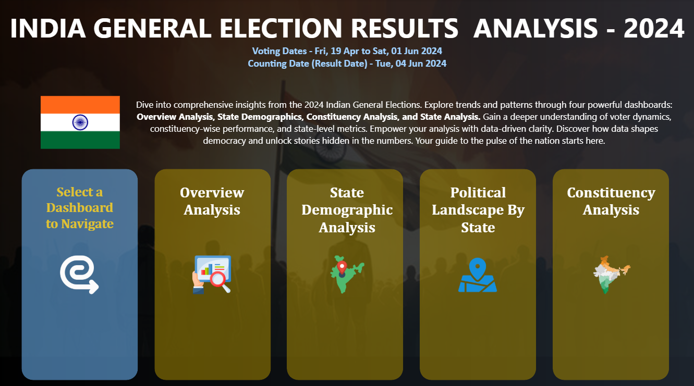
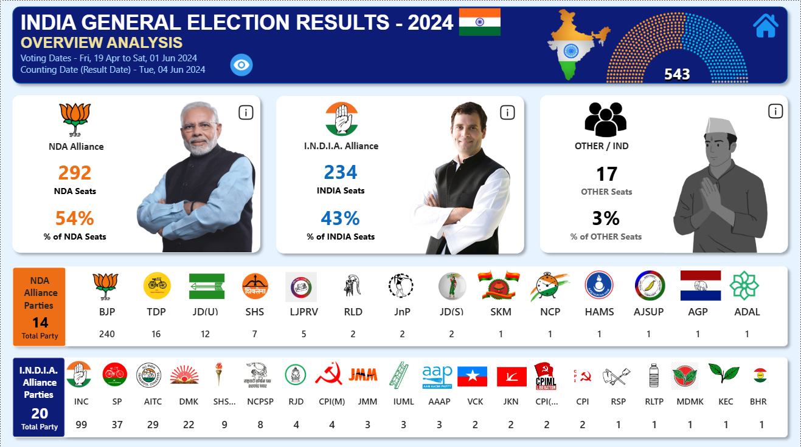

# India General Election Results – 2024 Power BI Dashboard

## ✨ Project Overview

This repository hosts the source files and documentation for an interactive data visualization dashboard providing a comprehensive analysis of the 2024 Indian General Election outcomes. The project is designed for political analysts, researchers, and the general public to gain deep insights into seat distribution, alliance performance, and constituency-level results.

The dashboard solution consists of six interconnected views, optimized for clear navigation and data exploration.

---

## Fron Page

---

## 🛠️ Dashboard Architecture & Key Features

The solution is built around a centralized data model (likely a Star Schema) to support fast, cross-filtered analysis across the following six dashboards:

### 1. 📊 Overview Analysis

| KPI/Metric | Description | Visual Element |
| :--- | :--- | :--- |
| **NDA Performance** | Total seats and percentage of the total secured by the NDA alliance. | KPI Cards, Detailed Grid (Bookmark) |
| **I.N.D.I.A. Performance** | Total seats and percentage of the total secured by the I.N.D.I.A. alliance. | KPI Cards, Detailed Grid (Bookmark) |
| **Other Performance** | Total seats and percentage for Independent candidates and smaller parties. | KPI Cards, Detailed Grid (Bookmark) |
| **Alliance Breakdowns** | Seat count and **Party Logo** display for every party within NDA and I.N.D.I.A. that won a seat. | Bar Charts / Tree Map with Images |

---

### 2. 🗺️ State Demographic Analysis

This dashboard provides a geographical breakdown of results across the nation.

* **State Map Chart:** Displays **Total Seats, Majority Alliance, NDA Seats, and I.N.D.I.A. Seats** per state (available in tooltip). Supports **Drill-through** to the Details Grid.
* **Constituency Bubble Map:** Bubbles represent individual constituencies. They are **color-coded** to distinguish **NDA** (Saffron/Orange), **I.N.D.I.A.** (Blue/Green), and **OTHER** (Grey) seats.
* **Majority State Highlight:** Map highlighting the state where either NDA or I.N.D.I.A. won the *maximum* seats.

### 3. 🔍 Political Landscape by State

A dynamic view where users can select a state to perform an in-depth analysis.

| Metric/Visualization | Purpose |
| :--- | :--- |
| **Key Metrics Display** | Seats won by I.N.D.I.A., NDA, and Other Parties for the selected state. |
| **State Map Chart** | Visualization of constituency boundaries within the selected state, showing seat distribution. |
| **Party-wise Result (Grid)** | Lists all winning parties in the state, including their alliance affiliation. |
| **Party-wise Seat Share** | **Donut Chart** illustrating the percentage share of total seats won by each party in the selected state. |

### 4. 🗳️ Constituency Analysis

A granular view focusing on a single selected constituency.

* **Primary KPIs:** Total Votes Cast, Total EVM Votes, Total Postal Votes, and Total Candidates.
* **Secondary KPIs:** Detailed performance data (Name, Party, Total Votes, Vote Share) for the **Winning Candidate, Runner-up, and 2nd Runner-up**.

### 5. 📋 Details Grid

The core data exploration tool, providing a sortable, comprehensive tabular view of all constituency-level results.

| Field Name | Description |
| :--- | :--- |
| **Constituency Name** | The name of the parliamentary constituency. |
| **Winning Candidate** | Name of the winner. |
| **Runner-Up Candidate** | Name of the runner-up. |
| **Party Name** | Winning Party name. |
| **Party Alliance** | **NDA**, **I.N.D.I.A.**, or **Independent/Other**. |
| **EVM Votes** | Electronic Voting Machine Votes. |
| **Postal Votes** | Postal Ballots Counted. |
| **Total Votes** | Sum of EVM + Postal Votes. |
| **Margin** | Vote difference between Winner and Runner-Up. |

**Functionality:** Supports **Drill-Through** from other dashboards, **Data Export** (Excel), and a **Show All Data** button.

### 6. 🏠 Landing Page

The central navigation hub.

* **Navigation Menu:** Clickable cards/buttons using the icons listed below to navigate to the respective dashboards.
* **User Interface (UI):** Minimalist & Clean Design, **Icons & Color Coding**, Hover Effects, and a **Responsive Layout**.
* **Home Button:** A dedicated Home Button on *every* dashboard to quickly return to the Landing Page.

---

## 🎨 Visual Assets & Color Coding

Consistent visual identity is maintained across all views for quick recognition (as specified in Dashboard 6).

| Alliance/Group | Color Code | Purpose |
| :--- | :--- | :--- |
| **NDA** | **Saffron/Orange** | Highlight seats, votes, and majority areas won by the NDA alliance. |
| **I.N.D.I.A.** | **Blue/Green** | Highlight seats, votes, and majority areas won by the I.N.D.I.A. alliance. |
| **Other/Independent** | **Grey/Neutral** | Seats won by other parties or independent candidates. |

### Dashboard Navigation Icons

| Dashboard | Icon Suggestion | Label |
| :--- | :--- | :--- |
| **Overview Analysis** | 📊 (Bar Chart/Tally) | Overview Analysis |
| **State Demographics** | 🗺️ (Map/Globe) | State Demographics |
| **Political Landscape by State** | 🔍 (Magnifying Glass on Map) | Political Landscape by State |
| **Constituency Analysis** | 🗳️ (Ballot Box/Pie Chart) | Constituency Analysis |
| **Details Grid** | 📋 (Clipboard/Table) | Details Grid |
| **Home Button** | 🏠 (Home) | Home |

---

## 🙋‍♀️ About Me
📊 I recently completed a data-driven project analyzing the India Election Results 2024 using Microsoft SQL Server, Power BI, and CSV datasets. I enjoy transforming raw data into meaningful insights and visual stories. My focus is on building efficient data models and interactive dashboards.
